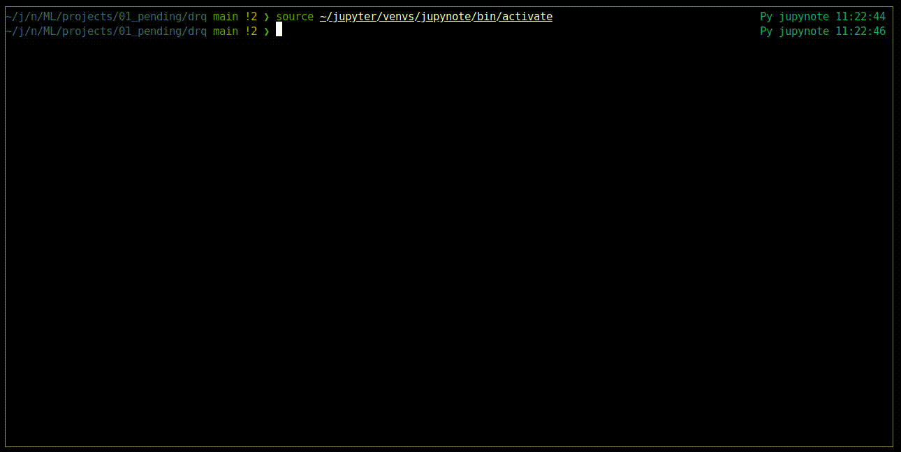

Random Quotes Generator (RQG) is a CLI tool that generates random quotes.  
Built with click framework

## Basic Usage


## How to Install
1. Create a virtual environment
2. Install the required packages
   ```bash
   make install
   ```

## Usage
```
Usage: rqg.py [OPTIONS] COMMAND

  This cli tool is used to get random quotes

Options:
  --version  Show the version and exit.
  --help     Show this message and exit.

Commands:
  add-new     Add a new quote to the database.
  get-random  Get random quote from the database
  list-all    List all the quotes available in the database
```

**Get random Quote**
```python
python rqg.py get-random
```

**List all available quotes**
```python
python rqg.py list-all
```

**Add a new quote to the database**
```python
python rqg.py add-new # Then Follow the prompt
```